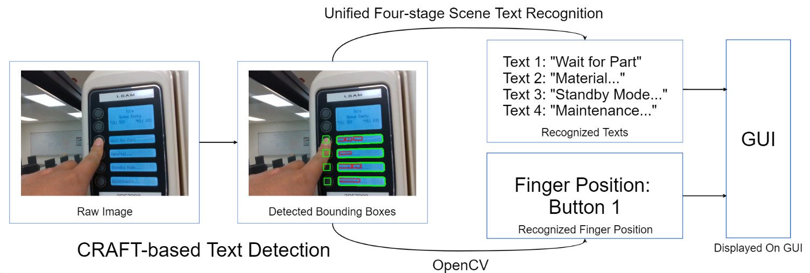

# Project Smart Connected Worker (SCW) - Module 2: 
## A CRAFT-based Automated System for Real-time Human-Machine Interaction Monitoring
This is the finger-text detection and recognition module for the [Smart Connect Worker project](https://github.com/BrandonBian/SCW-V1.0). 

This repository is the Python implementation regarding the CRAFT-based text recognition and detection model as well as the finger detection model for implementing real-time human-machine interaction monitoring. This work is largely based on the text detection model of [CRAFT](https://github.com/clovaai/CRAFT-pytorch).

The overall workflow of the finger-text detection and recognitionm module is as follows:

The weights used in this project are here: [weight1](https://drive.google.com/file/d/1uPHybaMrCO0iIz_4RAL44vn4iVxdK1xC/view?usp=sharing) and [weight2](https://drive.google.com/file/d/1nn9LtvmkGrpOyMc9r9ZJYiJu6JEbwGB9/view?usp=sharing)

This is a demonstration of the finger and text recognition module, which automatically identifies the texts as well as the human's finger positions in real-time for the monitoring of human-machine interactions:

